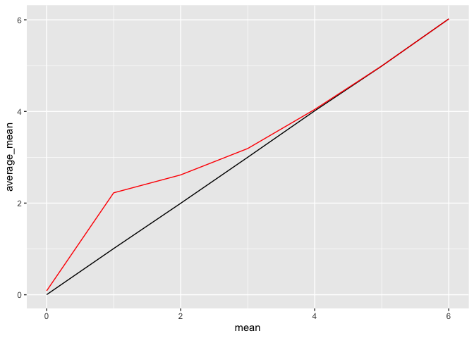

p8105_hw5_jkl2195
================
Jessie Li
2023-11-02

``` r
library(tidyverse)
```

    ## ── Attaching core tidyverse packages ──────────────────────── tidyverse 2.0.0 ──
    ## ✔ dplyr     1.1.3     ✔ readr     2.1.4
    ## ✔ forcats   1.0.0     ✔ stringr   1.5.0
    ## ✔ ggplot2   3.4.3     ✔ tibble    3.2.1
    ## ✔ lubridate 1.9.2     ✔ tidyr     1.3.0
    ## ✔ purrr     1.0.2     
    ## ── Conflicts ────────────────────────────────────────── tidyverse_conflicts() ──
    ## ✖ dplyr::filter() masks stats::filter()
    ## ✖ dplyr::lag()    masks stats::lag()
    ## ℹ Use the conflicted package (<http://conflicted.r-lib.org/>) to force all conflicts to become errors

``` r
library(readr)
library(stringr)
library(purrr)
library(broom)
library(forcats)
```

## Problem 1

``` r
df_homicide = read.csv("data/homicide-data.csv") |>
  mutate(
    city_state = str_c(city, ", ", state)
  ) |>
  select(-city, -state)
```

Number of Homicides organized by cities

``` r
df_unsolved_homicide = df_homicide |>
  group_by(city_state) |>
  summarize(
    total_homicides = n(), 
    unsolved_homicides = 
      sum(str_detect(disposition, "without|No"))
  )
df_unsolved_homicide
```

    ## # A tibble: 51 × 3
    ##    city_state      total_homicides unsolved_homicides
    ##    <chr>                     <int>              <int>
    ##  1 Albuquerque, NM             378                146
    ##  2 Atlanta, GA                 973                373
    ##  3 Baltimore, MD              2827               1825
    ##  4 Baton Rouge, LA             424                196
    ##  5 Birmingham, AL              800                347
    ##  6 Boston, MA                  614                310
    ##  7 Buffalo, NY                 521                319
    ##  8 Charlotte, NC               687                206
    ##  9 Chicago, IL                5535               4073
    ## 10 Cincinnati, OH              694                309
    ## # ℹ 41 more rows

Estimate the proportion of homicide that are unsolved in Baltimore, MD

``` r
  prop.test(
    df_unsolved_homicide |>
    filter(city_state == "Baltimore, MD") |> 
    pull(unsolved_homicides),
    df_unsolved_homicide |>
    filter(city_state == "Baltimore, MD") |> 
    pull(total_homicides)
  ) |>
  tidy() |>
  select(estimate, conf.low, conf.high)
```

    ## # A tibble: 1 × 3
    ##   estimate conf.low conf.high
    ##      <dbl>    <dbl>     <dbl>
    ## 1    0.646    0.628     0.663

``` r
df_unsolved_prop = df_unsolved_homicide |>
  mutate(
   estimate = map2(
    df_unsolved_homicide |>
      pull(unsolved_homicides),
    df_unsolved_homicide |>
      pull(total_homicides),
    prop.test
    ),
    estimate = map(estimate, tidy)
  ) |>
  unnest_wider(estimate) |>
  select(city_state, estimate, conf.low, conf.high)
```

    ## Warning: There was 1 warning in `mutate()`.
    ## ℹ In argument: `estimate = map2(...)`.
    ## Caused by warning in `.f()`:
    ## ! Chi-squared approximation may be incorrect

``` r
df_unsolved_prop
```

    ## # A tibble: 51 × 4
    ##    city_state      estimate conf.low conf.high
    ##    <chr>              <dbl>    <dbl>     <dbl>
    ##  1 Albuquerque, NM    0.386    0.337     0.438
    ##  2 Atlanta, GA        0.383    0.353     0.415
    ##  3 Baltimore, MD      0.646    0.628     0.663
    ##  4 Baton Rouge, LA    0.462    0.414     0.511
    ##  5 Birmingham, AL     0.434    0.399     0.469
    ##  6 Boston, MA         0.505    0.465     0.545
    ##  7 Buffalo, NY        0.612    0.569     0.654
    ##  8 Charlotte, NC      0.300    0.266     0.336
    ##  9 Chicago, IL        0.736    0.724     0.747
    ## 10 Cincinnati, OH     0.445    0.408     0.483
    ## # ℹ 41 more rows

This is a table of the proportion of unsolved homicides and the
confidence interval of each.

``` r
df_unsolved_prop |>
  ggplot(aes(x = city_state, y = estimate, color = city_state)) +
  geom_point() +
  geom_errorbar(aes(ymin = conf.low, ymax = conf.high)) +
  theme(
    legend.position="bottom", 
    axis.text.x = element_text(angle = 90, vjust = 0.5, hjust=1))
```

<!-- -->
This is a plot of the proportion of unsolved homicides bounded by the
confidence interval of each.

## Problem 2

``` r
filenames = list.files(path = "./data", pattern = ".+[0-9].+", full.names = TRUE)

df_study = map(filenames, read.csv) |>
  bind_rows() |>
  mutate(
    group = map(filenames, str_extract, "[:alpha:]{3}(?=_)") |>
      as.character(),
    id = map(filenames, str_extract, "[:digit:]{2}") |> 
      as.numeric()
  ) |>
  pivot_longer(
    cols = week_1:week_8,
    names_to = "week",
    names_pattern = "week_(.)",
    values_to = "observation"
  )
df_study
```

    ## # A tibble: 160 × 4
    ##    group    id week  observation
    ##    <chr> <dbl> <chr>       <dbl>
    ##  1 con       1 1            0.2 
    ##  2 con       1 2           -1.31
    ##  3 con       1 3            0.66
    ##  4 con       1 4            1.96
    ##  5 con       1 5            0.23
    ##  6 con       1 6            1.09
    ##  7 con       1 7            0.05
    ##  8 con       1 8            1.94
    ##  9 con       2 1            1.13
    ## 10 con       2 2           -0.88
    ## # ℹ 150 more rows

Cleaned up dataset about a longitudinal study that included a control
arm and an experimental arm.

``` r
df_study |>
  group_by(group, id) |>
  ggplot(aes(x = week, y = observation, group = interaction(group, id), color = group)) +
  geom_point() + 
  geom_line()
```

<!-- -->
This is a spaghetti plot of the observations on each subject over time.
The rate of change for the control group is constant while the rate of
change for experimental is increasing at a linear rate.

## Problem 3

``` r
n = 30
sets = 5000
sig = 5
alp = 0.05
h0 = 0

sim_normal = function(mu, n_samp = n, sigma = sig, alpha = alp, null= h0){
  rnorm(n = n_samp, mean = mu, sd = 5) |> 
  t.test(null.value = null, conf.level = 1-alpha)
}
 
df_sim_normal = expand_grid(
    mean = 0:6,
    iter = 1:sets
  ) |>
  mutate(
    estimate = map(mean, sim_normal),
    estimate = map(estimate, tidy)
  ) |>
  unnest_wider(estimate) |>
  select(mean, iter, estimate, p.value)

df_sim_normal
```

    ## # A tibble: 35,000 × 4
    ##     mean  iter estimate p.value
    ##    <int> <int>    <dbl>   <dbl>
    ##  1     0     1  -0.374  0.598  
    ##  2     0     2   1.85   0.0447 
    ##  3     0     3   0.0214 0.984  
    ##  4     0     4   0.821  0.500  
    ##  5     0     5  -2.31   0.0293 
    ##  6     0     6  -0.815  0.427  
    ##  7     0     7  -1.09   0.285  
    ##  8     0     8   1.60   0.188  
    ##  9     0     9   2.40   0.00988
    ## 10     0    10  -1.44   0.0565 
    ## # ℹ 34,990 more rows

Generated 5000 datasets with each mu 0 to 6 using randomized normal
distribution where n = 30, sigma = 5.

``` r
df_sim_normal |>
  group_by(mean) |>
  summarize(power = sum(p.value < alp) / sets) |>
  ggplot(aes(x = mean, y = power)) +
  geom_point() +
  geom_line()
```

<!-- -->

This is a plot the proportion of times the null was rejected (the power
of the test) on the y axis and the true value of mu on the x axis. There
is a positive relationship between the effect size and the power. Power
stayed around 1 after reaching around mean 4.

``` r
df_sim_normal |>
  group_by(mean) |>
  summarize(average_mean = mean(estimate)) |>
  ggplot(aes(x = mean, y = average_mean)) +
  geom_line() +
  geom_line(data = df_sim_normal |>
              filter(p.value < alp) |>
              group_by(mean) |>
              summarize(average_mean = mean(estimate)),
            color = "red")
```

<!-- -->

This a plot showing the average estimate of mu hat on the y axis and the
true value of mu on the x axis for all samples (black) vs samples for
which the null was rejected (red).

The sample average of mu hat is not approximately equal to the true
value of mu mainly due to the small sample size of 30. Larger sample
size can be used to higher the approximation.
